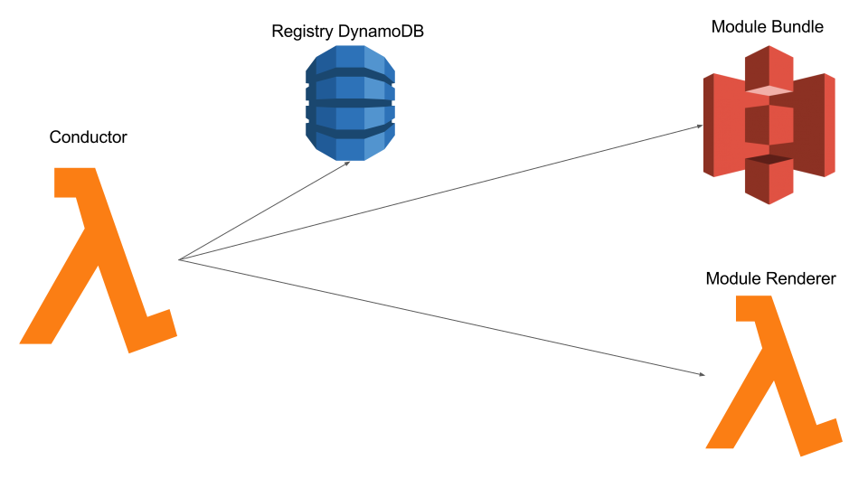

class: title

# Jacob's Lambda
&nbsp;
## Serverless Component Rendering a la carte

---

class: middle

.left[
# $ whoami
## Jacob Bass
]

.right[
## @bassjacob
## bassjacob@gmail.com
## github.com/subshad
## http://jacobbass.net
]

---

class: middle, center

---

class: middle

# Tooling
# Front End Ops
# Developer Experience (DX)

---

class: section

# FrontEnd Delivery Complexity

---

class: middle, image-background
background-image: url('public/monolith.jpg')

.right.white-title.dark-mask[
# One project
# One codebase
]

---

class: middle, image-background
background-image: url('public/modularity.jpg')

.right.white-title.dark-mask[
# Many projects
# Many codebases
]

---

class: center, middle, image-background
background-image: url('public/microservices.jpg')

.dark-mask.pull-left.white-title[
## I know, I'll use microservices...
]

---

class: section

# How do we server-side render JS on non-nodejs platforms?

---

class: center, middle

---

class: section

# How do we update nested component dependencies?

---

class: center, middle

---

class: section

# What do we do if something breaks?

---

class: center, middle

---

class: section

# What might a solution look like?

---

class: middle

## Reusable components between .red[pages]
## Reusable components between .red[languages]
## Components rendered on the .red[server] and .red[client]

---

class: center, middle, image-background
background-image: url('public/lambda_react.svg')

---

class: section

# Why ReactJS?

---

class: center, middle

# * Modularity
# * Encapsulation
# * Predicatbility

---

class: section

# Why AWS Lambda?

---

class: center, middle

# * Scalable
# * Distributed
# * Stateless

---

class: section

# RenderizrJS

&nbsp;

&nbsp;

&nbsp;

## When all you have is a lambda, everything starts to look stateless

---

### .top[RenderizrJS: Module]

---

### .top[RenderizrJS: Registry]

---

### .top[RenderizrJS: Conductor]

---

class: section, center, middle

# Features

---

class: center, middle

# * Server Side Rendered
# * Non-Runtime Specific
# * Reusable Components

---

class: section

# Demo

---

class: section

# Caveats

---

class: center, middle

# * Regional Support
# * Sleep/Startup Time
# * Latency

---

class: section

# ToDo

---

class: center, middle

# * CSS & CSS Modules
# * Globals Extraction
# * Tests :P

---

class: section

# QnA

---

class: center, middle, image-background
background-image: url('public/ddd_sponsors.svg')

