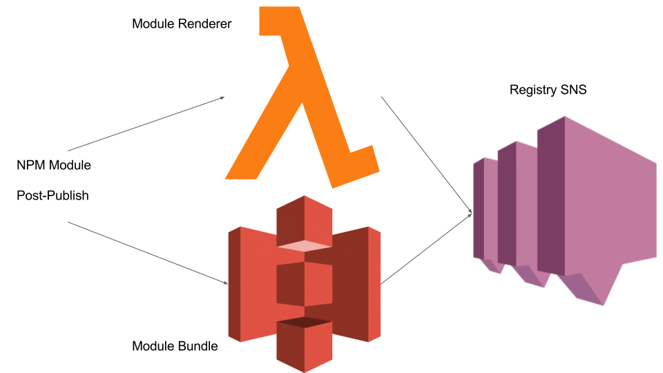

class: title

# Jacob's Lambda
&nbsp;
## Serverless Component Rendering a la carte

---

class: middle

.left[
# $ whoami
## Jacob Bass
]

.right[
## @bassjacob
## bassjacob@gmail.com
## github.com/subshad
## http://jacobbass.net
]

---

class: middle, center


---

class: middle

# Tooling
# Front End Ops
# Developer Experience (DX)

---

class: center, middle

# JavaScript Fatigue
## JavaScript Fatigue
### JavaScript Fatigue

---

class: section

# FrontEnd Delivery Complexity

---

class: middle, image-background
background-image: url('public/monolith.jpg')

.right.white-title.dark-mask[
# One project
# One codebase
]

---

class: center, middle, image-background
background-image: url('public/microservices.jpg')

.dark-mask.pull-left.white-title[
## I know, I'll use microservices...
]

---

class: middle, image-background
background-image: url('public/modularity.jpg')

.right.white-title.dark-mask[
# Many projects
# Many codebases
]

---

class: section

# How do we server-side render JS on non-nodejs platforms?

---

class: center, middle


---

class: section

# How do we update nested component dependencies?

---

class: center, middle


---

class: section

# What do we do if something breaks?

---

class: center, middle


---

class: section

# What might a solution look like?

---

class: middle

## Reusable components between .red[pages]
## Reusable components between .red[languages]
## Components rendered on the .red[server] and .red[client]

---

class: center, middle, image-background
background-image: url('public/lambda_react.svg')

---

class: section

# Why ReactJS?

---

class: center, middle

# * Modularity
# * Encapsulation
# * Predicatbility

---

class: section

# Why AWS Lambda?

---

class: center, middle

# * Scalable
# * Distributed
# * Stateless

---

class: section

# RenderizrJS

&nbsp;

&nbsp;

&nbsp;

## When all you have is a lambda, everything starts to look stateless

---

class: center, middle, image-background
background-image: url('public/overview.svg')

---

class: center

# RenderizrJS: Module
## * JS Bundle -> S3
## * Rendering Function -> Lambda

---

class: center, middle


---

```javascript
// import React, ReactDOMServer, Aphrodite etc.

export default function render(props, renderizrId) {
  return new Promise((res, rej) => {
      const component = require('/path/to/entry').default;
      const factory = React.createFactory(component);
      const styles = StyleSheetServer.renderStatic(
        () => ReactDOMServer.renderToString(factory(props))
      );
      const wrapped = wrap(className, props, renderizrId, styles);

      return res(wrapped);
    }
  });
}
```

---

class: center

# RenderizrJS: Registry
## For each module and version, tracks:
## * JS Bundle in S3
## * Rendering Function in Lambda

---

class: center, middle


---

class: center

# RenderizrJS: Conductor

## * Renders each instance to html
## * Returns S3 location of each bundle

---

```javascript
  const components = {
    a: {
      name: "renderizr-module-example",
      version: "0.0.1",
      props: {
        greeting: "hello",
        target: "world"
      }
    },
    b: ...
  };
```

---

```javascript
{
  // list of js bundles for each requested module
  js: [ 'https://s3-ap-northeast-1...e.js' ],
  html: {
    // base-64 encoded rendered html strings
    a: 'CiAgPHN...',
    b: ...
  }
}

```


---

class: center, middle


---

class: section, center, middle

# Features

---

class: center, middle

# * Server Side Rendered
# * Non-Runtime Specific
# * Reusable Components

---

class: section

# Caveats

---

class: center, middle

# * Regional Support
# * Sleep/Startup Time
# * Latency

---

class: section

# ToDo

---

class: center, middle


# * CSS & CSS Modules
# * Globals Extraction
# * Tests :P

---

class: section

# Demo

---

class: section

## .white-title[https://github.com/renderizrjs]

---

class: section

# QnA

---

class: center, middle, image-background
background-image: url('public/ddd_sponsors.svg')

